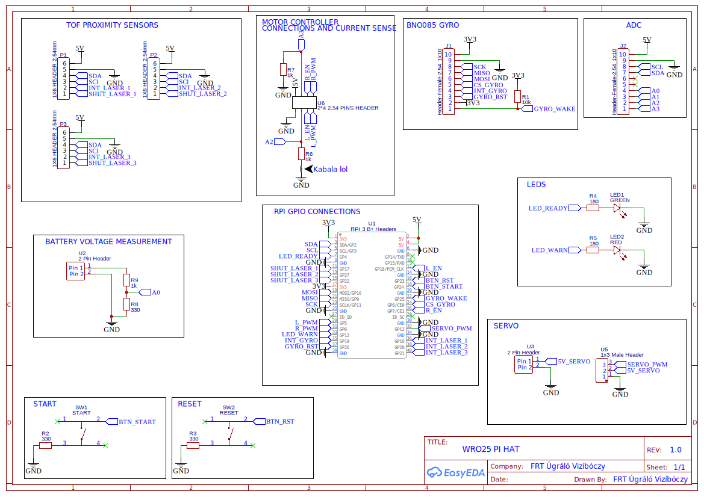

Electromechanical diagrams
====

**We have custom designed two PCBs for our robot.**

1. Pi Hat style PCB for sensors and motor controller connections to the Raspberry Pi via the 40 pin GPIO header.
2. A simple PCB made for power distribution.

## Pi Hat Circuit diagram

## Power distribution board
![Power distribution board](power_distribution.svg]

